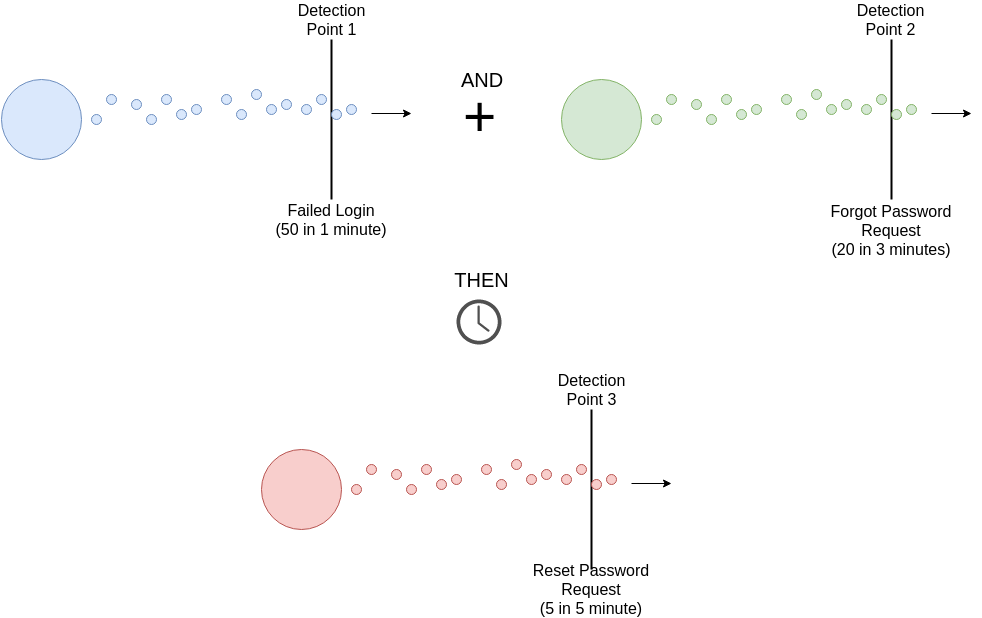

Rules Based Analysis Engines
=========


**Disclaimer**

This component is in early beta. Please do not introduce into a production environment without thorough testing. That being said, early beta also means we need testers! Please try it out and share your experience with us.

What is it?
------------
The rules based analysis engine is an alternative component to the reference analysis engine. The reference implementation generates an attack when enough events have occured in a short enough period of time to trigger the threshold of a Detection Point.


The rules based implemention, on the other hands, combines multiple Detection Points with logical operators. For example, you could make a Rule that generates an Attack when both Detection Point 1 AND Detection Point 2 are triggered. The rules implementation supports boolean operators AND and OR, as well as a temporal operator THEN. This allows for complex combinations such as Detection Point 1 AND Detection Point 2 OR Detection Point 3 Then Detection Point 4.



Why use it?
------------
There were several goals for the rules engine.

First, to provide greater flexibility. Configurations can be more expressive, creative, and customized for a web applications needs.

Secondly, and more importantly, to improve accuracy. Aggregating multiple Detection Point improves confidence in detecting malicious activity, reducing false positives. It can also be leveraged to lower the thresholds of Detection Points, while maintaining confidence in detection, reducing false negatives.

How does it work?
------------
A Rule is made up of one or more Expressions. An Expression is a group of monitor points and operators seperated by chronilogical order using THEN operators.
i.e. in our example "dp1 and dp2 or dp3" is one expression while "dp4" is another expression.
A Rule will generate an Attack only if each of it's Expressions evaluates to true and has been triggered within its window of time.

An Expression is made up of one or more Clauses. A Clause is a a group of monitor points separated by the OR operator.
i.e. in our example "dp1 and dp2" and "dp3" would be clauses of the first expression, while the only clause in the second expression would be "dp4"
An Expression will evaluate to true and be triggered only if each of it's Clauses evalutes to true and has been triggered within its window of time.


A Clauses is made up of one or more Monitor Points. A Monitor Point represents a specific sensor and is separated within a Clause by the AND operator.
A Monitor Point is essentially the same thing as a Detection Point, except that they cannot trigger Attacks on their own. Where a configured Detection Point stands alone and will generate an Attack when their Threshold is crossed, a configured Monitor Point can only be a part of a Rule and does not generate an attack when it's Threshold is crossed. Rather only when the proper configuration of Monitor Points in a Rule definition are triggered will the Rule then generate an Attack.
i.e. each sensor in our example represents a Monitor Point.
A Clause will evaluate to true and be triggered only if each of its Monitor Points is triggered.

How do I use it?
------------
1) Include the appsensor-analysis-rules dependency in your pom.xml file just as you would the appsensor-analysis-reference dependecy.
```xml
<dependency>
	<groupId>org.owasp.appsensor</groupId>
	<artifactId>appsensor-analysis-rules</artifactId>
	<version>${appsensor.version}</version>
</dependency>
```

2) Add your rules definition to the appsensor-server-config.xml file. An example of defining rules can be found [here](https://github.com/dscrobonia/appsensor/blob/feature-rules-engine-removing-not/configuration-modes/appsensor-configuration-stax/src/test/resources/appsensor-server-rules-standard-multiple-config.xml) and the definitions can be found at [here](https://github.com/dscrobonia/appsensor/blob/feature-rules-engine-removing-not/appsensor-core/src/main/resources/appsensor_server_config_2.0.xsd).
```xml
<rules>	
<rule guid="00000000-0000-0000-0000-000000000005">
	<name>Rule 2</name>
	<window unit="seconds">10</window>
	<expressions>				
	<expression>
		<window unit="seconds">5</window>
		<clauses>
		<clause>
			<monitor-points>
			<monitor-point guid="00000000-0000-0000-0000-000000000006">
				<category>Input Validation</category>
				<id>IE1</id>
				<threshold>
					<count>1</count>
					<interval unit="seconds">5</interval>
				</threshold>
			</monitor-point>
			</monitor-points>
		</clause>
		</clauses>
	</expression>
	</expressions>
</rule>
</rules>
```

3) Run it! You can see a sample REST configuration with Rules implemented [here](https://github.com/dscrobonia/appsensor/tree/feature-rules-engine/sample-apps/appsensor-ws-rest-server-with-websocket-boot-rules).

FAQ's
------------
I want both the traditional singe-Detection Point model from the reference engine AND rules as well. Can I use both engines in tandem?
> Yes! By including both engines in your pom.xml, and configureing both in your server config you can leverage both systems.

Do I need to redefine Monitor Points in my appsensor-server-config.xml file if I've already defined matching Detection Points?
> Yes. The Monitor Point server configurations are separate from the Detection Point server Confirations

Do I need to create separate sensors to generate different events for the Monitor Points, as opposed to Detection Points?
>No, as long as an Event generated by your sensor matches the id and category of the Monitor Point, it will work the same.

I want to change the order of my logic. How can I write rules such as "sensor 1 and (sensor2 or sensor3)" without the parenthetical precedence operator?
>Distribute it into "sensor 1 and sensor 2 or sensor 1 and sensor 3". We hope to soon build a helper tool that will generate the proper XML configuration from a more natural form like in the question. But for now there is only one level of precedence.
